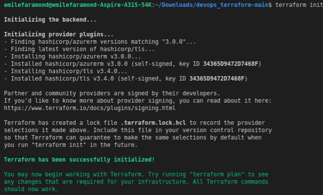
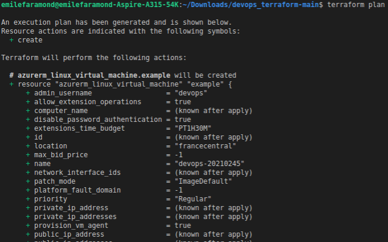
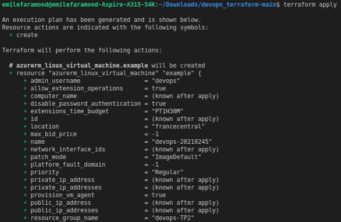
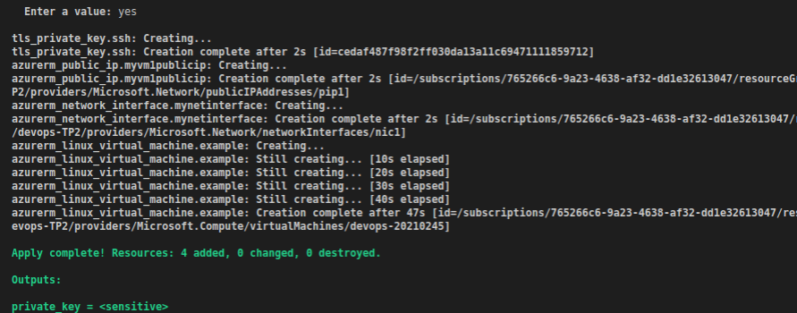
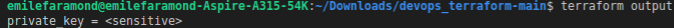

## DEVOPS - TP4 - DEVOPS  - Terraform 101
## FARAMOND Emile - EFREI - M1 BDIA APP


### Objectifs  

> Créer une machine virtuelle Azure (VM) avec une adresse IP publique

> Utiliser Terraform  

> Se connecter à la VM avec SSH  

> Comprendre les différents services Azure (ACI vs. AVM)  

> Mettre à disposition son code dans un repository Github

>   Aide :  [Terraform Providers](https://registry.terraform.io/providers/hashicorp/azurerm/latest/docs/guides/azure_cli#loggin )

### Pré-requis : 
> Installer Azure CLI : La documentation est dispo au lien : [Install Azure CLI](https://docs.microsoft.com/fr-fr/cli/azure/install-azure-cli-linux?pivots=apt)

Pour ma part, sur ubuntu : 
```bash
curl -sL https://aka.ms/InstallAzureCLIDeb | sudo bash
```
puis pour s'identifier sur azure :
```
az login
```
> Installer Terraform : La documentation est dispo au lien : [Install Terraform](https://learn.hashicorp.com/tutorials/terraform/install-cli)

Attention : il faut s'asurer d'avoir la bonne version de Terraform (Terraform v0.14.3)


### Exécution

````bash
terraform init 
````


````bash
terraform plan 
````



````bash
terraform apply
````



````bash
terraform output
````


### 8. Connexion à la VM Azure avec SSH

````bash
ssh -i privateKey.txt devops@<ma_clé_publique_VM> cat /etc/os-release
````

````bash
$ terraform destroy
````
